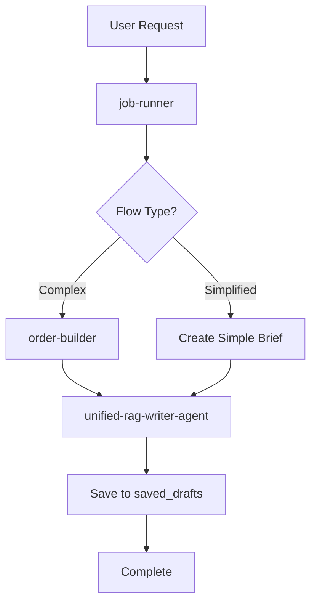

# Content Creation Flow Analysis

## 🔄 Current Content Creation Flow

Based on the analysis of the edge functions, here's the current content creation flow and which functions are obsolete.

## 📊 Flow Analysis

### Current Active Flow (Unified RAG)



### Detailed Flow Steps

#### 1. Job Runner (`job-runner`)
**Status**: ✅ **ACTIVE** - Core orchestrator
- **Purpose**: Orchestrates the entire content creation process
- **Job Types**: 
  - `process_order` - Main content creation
  - `pacing_content_generation` - Scheduled content
  - `pacing_check` - Pacing validation
  - `draft_review` - Draft review process

#### 2. Order Builder (`order-builder`) 
**Status**: ✅ **ACTIVE** - Still used for complex flow
- **Purpose**: Creates detailed content briefs from content orders
- **Used in**: Complex flow only (not simplified flow)
- **Output**: Structured brief with topic, platform, tone, angle, etc.

#### 3. Unified RAG Writer Agent (`unified-rag-writer-agent`)
**Status**: ✅ **ACTIVE** - Primary content generator
- **Purpose**: Combines retrieval, writing, and editing in one function
- **Features**:
  - RAG (Retrieval Augmented Generation)
  - Knowledge base integration
  - Content generation
  - Citation management
- **Replaces**: `retrieval-agent` + `writer-agent` + `editor-agent`

## 🗑️ Obsolete Functions (Can be Deleted)

### 1. Retrieval Agent (`retrieval-agent`)
**Status**: ❌ **OBSOLETE**
- **Reason**: Functionality moved to `unified-rag-writer-agent`
- **Last Used**: Before unified agent implementation
- **Function Definition**: Exists in `job-runner` but never called
- **Safe to Delete**: ✅ Yes

### 2. Writer Agent (`writer-agent`)
**Status**: ❌ **OBSOLETE**
- **Reason**: Functionality moved to `unified-rag-writer-agent`
- **Last Used**: Before unified agent implementation
- **Function Definition**: Exists in `job-runner` but never called
- **Safe to Delete**: ✅ Yes

### 3. Editor Agent (`editor-agent`)
**Status**: ❌ **OBSOLETE**
- **Reason**: Functionality moved to `unified-rag-writer-agent`
- **Last Used**: Before unified agent implementation
- **Function Definition**: Exists in `job-runner` but never called
- **Safe to Delete**: ✅ Yes

## 🔍 Function Usage Analysis

### Functions Called in Current Flow

```typescript
// Current active call chain in job-runner:
switch (job.type) {
  case 'process_order':
    if (isSimplifiedFlow) {
      // Simplified: Direct to unified agent
      callUnifiedRAGWriterAgent()
    } else {
      // Complex: Order builder → Unified agent
      callOrderBuilder() → callUnifiedRAGWriterAgent()
    }
    break;
  case 'pacing_content_generation':
    callOrderBuilder() → callUnifiedRAGWriterAgent()
    break;
}
```

### Obsolete Function Definitions (Dead Code)

```typescript
// These functions are defined but NEVER called:
async function callRetrievalAgent() { /* DEAD CODE */ }
async function callWriterAgent() { /* DEAD CODE */ }
async function callEditorAgent() { /* DEAD CODE */ }
```

## 🧹 Cleanup Recommendations

### 1. Delete Obsolete Edge Functions
```bash
# Safe to delete these directories:
rm -rf supabase/functions/retrieval-agent/
rm -rf supabase/functions/writer-agent/
rm -rf supabase/functions/editor-agent/
```

### 2. Clean Up job-runner Code
Remove these obsolete function definitions from `supabase/functions/job-runner/index.ts`:
- `callRetrievalAgent()` (lines ~626-650)
- `callWriterAgent()` (lines ~654-680)
- `callEditorAgent()` (lines ~681-706)

### 3. Update Documentation
- Remove references to old three-step flow
- Document current unified flow
- Update API documentation

## 🔄 Flow Comparison

### Old Flow (Obsolete)
```
job-runner → order-builder → retrieval-agent → writer-agent → editor-agent → save
```

### Current Flow (Active)
```
job-runner → [order-builder] → unified-rag-writer-agent → save
```

**Benefits of Current Flow**:
- ✅ Faster execution (fewer API calls)
- ✅ Better context retention
- ✅ Reduced complexity
- ✅ Lower latency
- ✅ Fewer failure points

## 🎯 Content Creation Flows

### 1. Simplified Flow
**Trigger**: Direct user message
**Steps**:
1. `job-runner` receives job with `simplified_flow: true`
2. Creates simple brief from user message
3. Calls `unified-rag-writer-agent` directly
4. Saves result to `saved_drafts`

### 2. Complex Flow
**Trigger**: Structured content order
**Steps**:
1. `job-runner` receives `process_order` job
2. Calls `order-builder` to create detailed brief
3. Calls `unified-rag-writer-agent` with brief
4. Saves result to `saved_drafts`

### 3. Pacing Flow
**Trigger**: Scheduled content generation
**Steps**:
1. `job-runner` receives `pacing_content_generation` job
2. Calls `order-builder` with pacing context
3. Calls `unified-rag-writer-agent` with enhanced brief
4. Saves result to `saved_drafts`

## 🔧 Active Supporting Functions

### Knowledge Base Storage (`knowledge-base-storage`)
**Status**: ✅ **ACTIVE**
- **Purpose**: GCS integration for file management
- **Used by**: `unified-rag-writer-agent` for RAG

### Context Analysis Agent (`context-analysis-agent`)
**Status**: ✅ **ACTIVE**
- **Purpose**: Analyzes content context
- **Uses**: `unified-rag-writer-agent` for content generation

### AI Assistant (`ai-assistant`)
**Status**: ✅ **ACTIVE**
- **Purpose**: General AI assistance
- **References**: Some writer-agent patterns (but doesn't call it)

## 📈 Performance Impact

### Before (Old Flow)
- **API Calls**: 4-5 sequential calls
- **Latency**: ~15-30 seconds
- **Failure Points**: 4-5 potential failures
- **Context Loss**: Between agent transitions

### After (Current Flow)
- **API Calls**: 2-3 sequential calls
- **Latency**: ~8-15 seconds
- **Failure Points**: 2-3 potential failures
- **Context Retention**: Full context maintained

## 🚀 Next Steps

1. **Immediate**: Delete obsolete functions
2. **Code Cleanup**: Remove dead code from job-runner
3. **Testing**: Verify unified flow works correctly
4. **Documentation**: Update API docs and flow diagrams
5. **Monitoring**: Ensure no references to old functions exist

## 🔗 Related Functions

### Still Active and Important
- `job-runner` - Core orchestrator
- `order-builder` - Brief creation (complex flow)
- `unified-rag-writer-agent` - Content generation
- `knowledge-base-storage` - File management
- `context-analysis-agent` - Context analysis
- `pacing-scheduler` - Content scheduling
- `ui-content-order` - UI content ordering

### Safe to Delete
- `retrieval-agent` - Replaced by unified agent
- `writer-agent` - Replaced by unified agent  
- `editor-agent` - Replaced by unified agent

---

*Analysis completed: December 2024*
*Flow version: Unified RAG (v2.0)*
*Obsolete functions identified: 3*
